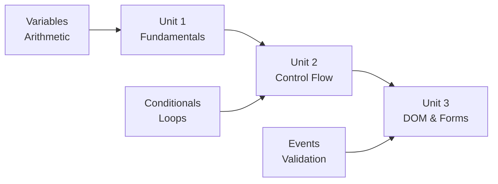

# 🚀 JavaScript Exercises - Progressive Learning Path

A comprehensive collection of 11 self-contained JavaScript exercises organized into three progressive units, from fundamentals to DOM manipulation and form validation.


## 📋 Table of Contents

- [Overview](#overview)
- [Repository Structure](#repository-structure)
- [Getting Started](#getting-started)
- [Learning Path](#learning-path)
- [Exercise Catalog](#exercise-catalog)
- [Technical Stack](#technical-stack)
- [Features](#features)
- [Pedagogical Approach](#pedagogical-approach)
- [Code Examples](#code-examples)
- [Contributing](#contributing)
- [License](#license)
- [Links](#links)

## 🎯 Overview

This repository contains a pedagogically structured JavaScript curriculum designed for progressive learning. Each exercise is a standalone HTML file with embedded CSS and JavaScript, requiring **zero external dependencies, build tools, or frameworks**.

**Key Characteristics:**
- ✅ No package managers (NPM, Yarn)
- ✅ No build tools (Webpack, Babel)
- ✅ No libraries (jQuery, React)
- ✅ Pure vanilla JavaScript
- ✅ Self-contained HTML files
- ✅ Modern CSS styling

## 📁 Repository Structure

```
Kl4rkx/Javascript_exercises_2_8/
├── index.html                              # Modern navigation hub
├── js_exercises_1/                         # Unit 1: Fundamentals
│   ├── 1/index.html                        # Calculator
│   └── 2/index.html                        # Number Comparison
├── js_exercises_2/                         # Unit 2: Control Flow
│   ├── 1/index.html                        # Positive/Negative Check
│   ├── 2/index.html                        # Color Translation (Switch)
│   ├── 3/index.html                        # Color Translation (While)
│   ├── 4/index.html                        # Cat/Dog Counter
│   ├── 5/index.html                        # Multiplication Table
│   └── 6/index.html                        # Banking Simulation
└── js_exercises_3/                         # Unit 3: DOM & Forms
    ├── exercise1/index.html                # Prize Selector
    ├── exercise2/index.html                # Math Operations Form
    └── exercise3/index.html                # Password Validator
```

## 🚀 Getting Started

### Prerequisites

- Any modern web browser (Chrome, Firefox, Safari, Edge)
- A text editor (VS Code, Sublime Text, etc.) - optional for viewing code

### Running Exercises

**Option 1: Direct File Access**
```bash
# Clone the repository
git clone https://github.com/Kl4rkx/Javascript_exercises_2_8.git

# Navigate to the repository
cd Javascript_exercises_2_8

# Open the navigation page
open index.html  # macOS
start index.html # Windows
xdg-open index.html # Linux
```

**Option 2: Local Server (Recommended)**
```bash
# Using Python 3
python -m http.server 8000

# Using Node.js
npx http-server

# Then navigate to http://localhost:8000
```

## 📚 Learning Path

The curriculum follows a scaffolded progression model:



### Unit 1: Fundamentals (Complexity: 0.75)
**Focus:** Variables, arithmetic operations, basic I/O  
**APIs:** `prompt()`, `document.write()`, basic operators

### Unit 2: Control Flow (Complexity: 0.75-2.55)
**Focus:** Conditionals, switch statements, loops  
**APIs:** `if/else`, `switch`, `while`, `do-while`, `for`, `alert()`

### Unit 3: DOM Manipulation (Complexity: 2.75-7.00)
**Focus:** Event-driven programming, forms, validation  
**APIs:** `getElementById()`, `innerHTML`, `value`, `onclick`, `Math.sqrt()`

## 📖 Exercise Catalog

### Unit 1: JavaScript Fundamentals

| Exercise | File | Concepts | Difficulty |
|----------|------|----------|------------|
| **1.1 Calculator** | `js_exercises_1/1/index.html` | Variables, arithmetic, `prompt()` | ⭐ |
| **1.2 Number Comparison** | `js_exercises_1/2/index.html` | Comparison operators, conditionals | ⭐ |

### Unit 2: Control Flow Structures

| Exercise | File | Concepts | Difficulty |
|----------|------|----------|------------|
| **2.1 Polarity Check** | `js_exercises_2/1/index.html` | `if/else` statements | ⭐ |
| **2.2 Color Switch** | `js_exercises_2/2/index.html` | `switch` statement | ⭐ |
| **2.3 Color Loop** | `js_exercises_2/3/index.html` | `while` loop | ⭐⭐ |
| **2.4 Cat/Dog Counter** | `js_exercises_2/4/index.html` | `do-while` loop | ⭐⭐ |
| **2.5 Multiplication Table** | `js_exercises_2/5/index.html` | `for` loop | ⭐⭐ |
| **2.6 Banking Simulation** | `js_exercises_2/6/index.html` | State management, menus | ⭐⭐⭐ |

### Unit 3: DOM Manipulation and Interactive Forms

| Exercise | File | Concepts | Difficulty |
|----------|------|----------|------------|
| **3.1 Prize Selector** | `js_exercises_3/exercise1/index.html` | DOM manipulation, image swapping | ⭐⭐⭐ |
| **3.2 Math Operations** | `js_exercises_3/exercise2/index.html` | Form inputs, calculations | ⭐⭐⭐ |
| **3.3 Password Validator** | `js_exercises_3/exercise3/index.html` | Form validation, string comparison | ⭐⭐⭐ |

## 🛠 Technical Stack

### Core Technologies
- **HTML5**: Semantic structure
- **CSS3**: Modern styling with gradients, flexbox, transitions
- **JavaScript (ES5+)**: Vanilla JavaScript with no dependencies

### Browser APIs Used
- **Window API**: `prompt()`, `alert()`
- **DOM API**: `document.getElementById()`, `innerHTML`, `value`, `document.write()`
- **Math API**: `Math.sqrt()`, arithmetic operators
- **Event Handling**: `onclick` inline handlers

### Design Patterns

**Unit 1 Pattern: Immediate Execution**
```javascript
// Code executes on page load
let input = prompt("Enter value");
// Process and output
document.write(result);
```

**Unit 2 Pattern: Dialog-Based I/O**
```javascript
// Loop-based interaction
do {
    input = prompt("Menu options");
    switch(input) {
        case "1": // Handle option
    }
} while (input !== "exit");
```

**Unit 3 Pattern: Event-Driven**
```javascript
// HTML: <input type="button" onclick="calculate()">
function calculate() {
    let value = document.getElementById('input').value;
    // Process and alert
}
```

## ✨ Features

### Modern Navigation Hub
- 🎨 Gradient backgrounds with purple aesthetic
- 📱 Responsive card-based layout
- 🎯 Organized by pedagogical units
- ⚡ Smooth hover transitions
- 📊 Exercise descriptions and difficulty indicators

### Exercise Design
- 🎨 Unique color schemes per exercise
- 💅 Modern CSS with gradients and shadows
- 📐 Centered, responsive layouts
- ✅ Input validation where applicable
- 🔄 Smooth transitions and hover effects

### Code Quality
- 📝 Clear variable naming
- 💬 Inline comments (where present)
- 🎯 Single-responsibility functions
- 🔒 Input validation in advanced exercises

## 🎓 Pedagogical Approach

The exercises follow a **scaffolded learning model**:

1. **Concrete → Abstract**: Start with tangible operations (calculator) before abstract concepts (validation)
2. **Simple → Complex**: Progress from single operations to multi-step logic
3. **Guided → Independent**: Early exercises use `prompt()`, later ones use forms
4. **Immediate → Deferred**: Move from synchronous execution to event-driven patterns

## 📝 Code Examples

### Example: Mathematical Operations Form

The `CalculateHalf1()` function demonstrates the standard pattern used across Unit 3:
1. Retrieve value from DOM element
2. Parse to appropriate type
3. Perform operation
4. Display result via `alert()`

### Example: Banking Simulation State Management

State variables track deposits, withdrawals, and balance across loop iterations, demonstrating accumulation patterns.

## 🤝 Contributing

This is an educational repository. If you find issues or have suggestions:

1. Fork the repository
2. Create a feature branch
3. Make your changes
4. Submit a pull request

## 📄 License

This project is open source and available under the MIT License.

## 🔗 Links

- **Repository**: [Kl4rkx/Javascript_exercises_2_8](https://github.com/Kl4rkx/Javascript_exercises_2_8)
- **Live Demo**: Open `index.html` in your browser

## 📧 Contact

For questions or feedback, please open an issue in the repository.

---

**Made with ❤️ for JavaScript learners**

---
